# cardIO

A personal YGO / MTG card collection web app (PWA in the future) — multi-user, with deck building and buylist export.


## Overview

**cardIO** is a personal collection-management system for Yu-Gi-Oh! and Magic: The Gathering players. It could look up cards through the [Scryfall](https://scryfall.com) and [YGOPRODeck](https://ygoprodeck.com) APIs, and add them to your collection in one click. The collection reflects multiple variants per card (YGO rarities, MTG nonfoil/foil/etched). The deck builder **searches your collection first**, then falls back to external search for the rest, and exports the "missing cards" as a CSV with TCGPlayer search links and live price estimates — take it straight to a store or shop online.

The whole app is deployed on Vercel + Supabase. One codebase, mobile and desktop browsers.

## Motivation

Most card tools sit at one of two extremes: encyclopedic lookup or deck-sharing communities (Scryfall / YGOPRODeck). The middle ground — *my* inventory and how it relates to *my* deck ideas — is empty. I decided to build a collection-management system for my cards.
It has to be an encyclopedia, an inventory, and a deck builder all at once. The user can access it on a desktop and also on a mobile device. And here is the **cardIO**.


## Features

### 🔐 Auth & Multi-user
- Google OAuth + email/password
- Supabase Auth + Row Level Security: every user reads/writes only their own `user_cards` and `decks`

### 🔍 Card Search
- Dual game: YGO (YGOPRODeck `cardinfo.php`) + MTG (Scryfall `cards/search`)
- **Advanced search and sort**: Type / Attribute / Race / Level / Set / Keyword / ATK / DEF for YGO, and Type / Set / Keyword / Colors / Mana Value / Power / Toughness for MTG
- **Special-character handling**: typing "Evil Twin" finds the `Evil★Twin` archetype via a parallel archetype-name lookup
- **Full-art split**: Scryfall `unique=art` so different artworks of the same card show up as separate results

### 📦 Collection Management
- Every row has `+ / − / Remove` controls for direct quantity adjustment
- **Variant axis**: a single `variant` column unifies YGO rarities (Common, Secret Rare, …) and MTG finishes (Nonfoil, Foil, Etched)
- Same card with different variants = different inventory rows; same `card_id` aggregates into a total-owned count
- **CSV export**: separate YGO / MTG files, dated filenames (`cardio-ygo-collection-20260512.csv`)

### 🃏 Deck Builder
- **Collection-first search**: defaults to "From collection"; one click to fall back to "All cards"
- **3-stage display**: every search result shows `− N +` instead of just `+`; cards already in the deck get an emerald border and a "· in deck N" tag in the subtitle
- **Automatic board routing**: YGO Fusion / Synchro / Xyz / Link monsters land in the Extra Deck automatically
- **Live legality checks**:
  - YGO: fetches the daily TCG banlist (`banlist=tcg`); Forbidden / Limited / Semi-Limited rows get a red border
- **Missing-card buylist CSV**: walks the deck, computes `needed = max(0, inDeck − owned)`, **refetches prices live** from Scryfall / YGOPRODeck (the cached payload could be months stale), and exports a buylist with TCGPlayer search URLs, per-card estimates, subtotals, and a grand total

### ☁️ Deployment & Operations
- **Vercel auto-deploy** on `git push`
- **Vercel Cron**: a daily 12:00 UTC ping to `/api/health` keeps the Supabase free-tier project from auto-pausing after 7 days
- **`/api/health` is Bearer-protected**: requires `Authorization: Bearer ${CRON_SECRET}` so the endpoint isn't publicly callable

## User Guide

### First-time setup

1. Open [cardio-delta.vercel.app](https://cardio-ph97zgsy0-lulu-wu-s-projects.vercel.app/login)
2. Click **"Continue with Google"** (or sign up with email + password)

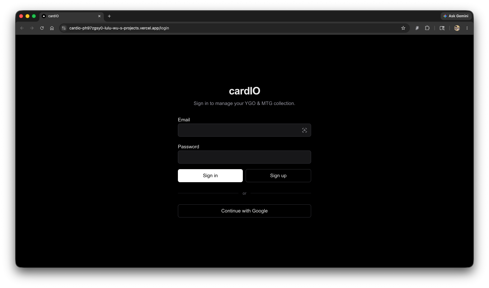

3. First sign-in creates the account and redirects to `/search`
4. The top-right corner will show **"Hello, \<your account name>"**

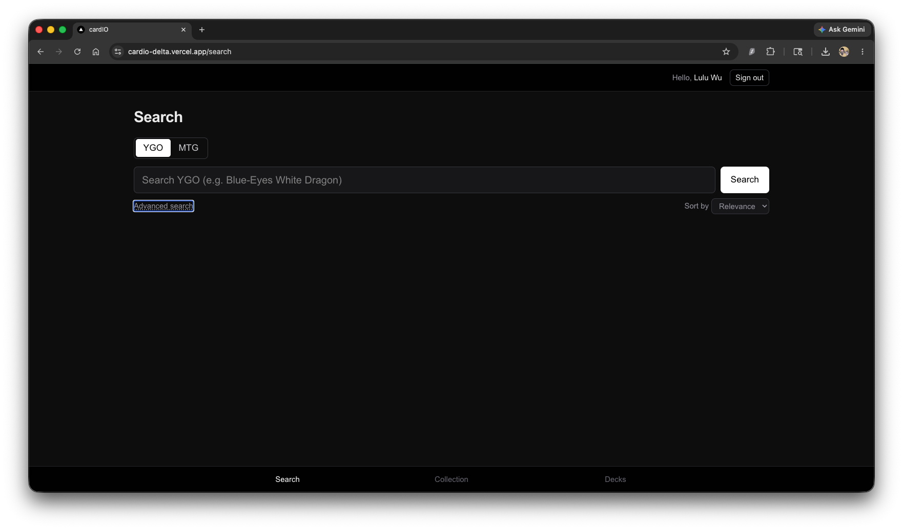

### Adding your first card

1. On `/search`, pick the `YGO` or `MTG` tab
2. Type a card name (≥ 2 characters) and press Search or Enter

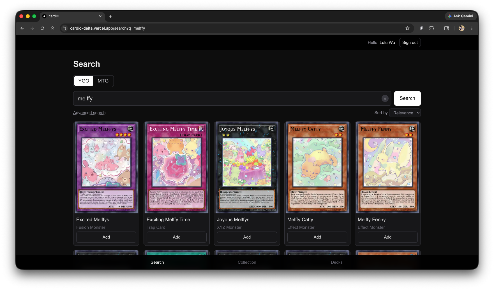

3. Click a result to open the detail page

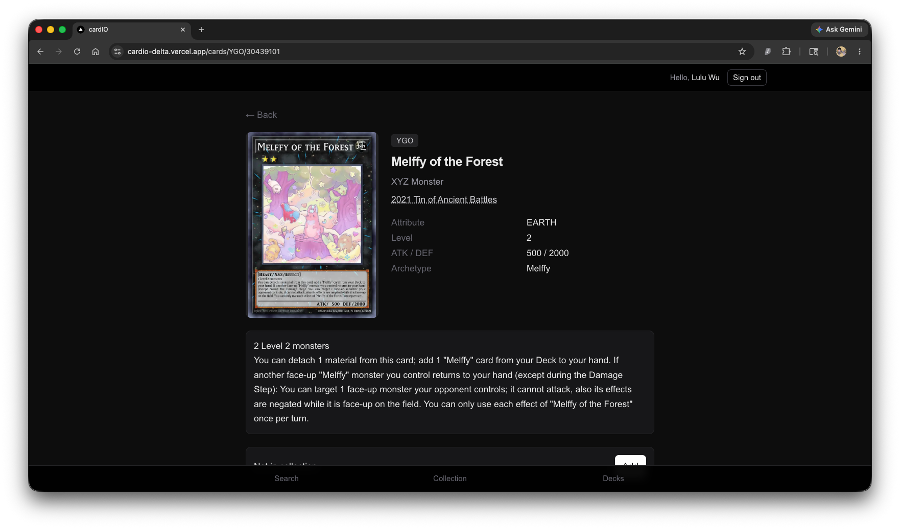

4. Press **Add**, pick a variant (YGO rarity / MTG finish), press **Confirm**

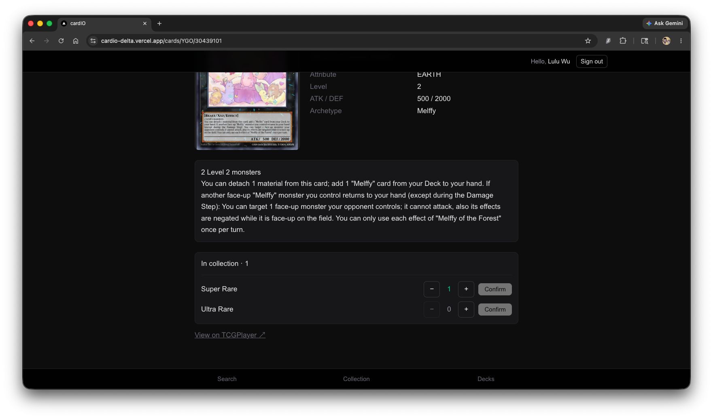

### Advanced search

Expand the **"Advanced search"** panel for:

- **YGO**: Type (28-option dropdown) / Attribute (7) / Race (text) / Set / Keyword / Level (0–12) / ATK / DEF
- **MTG**: Type (8) / Set / Keyword / Colors (WUBRG with C mutually exclusive) / Mana Value / Power / Toughness

Modify any field, then press **Apply** to run the search or **Reset** to clear everything.

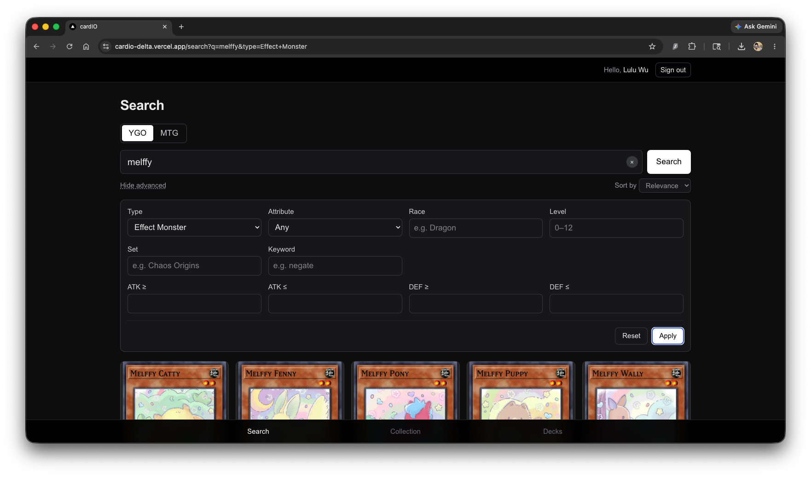

### Managing your collection

On `/collection`:

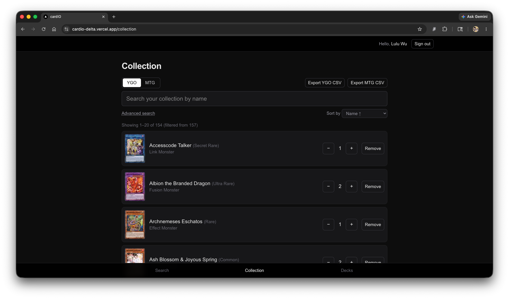

1. Game tabs at the top toggle YGO / MTG
2. **Export YGO CSV** / **Export MTG CSV** in the top-right does full-collection dumps

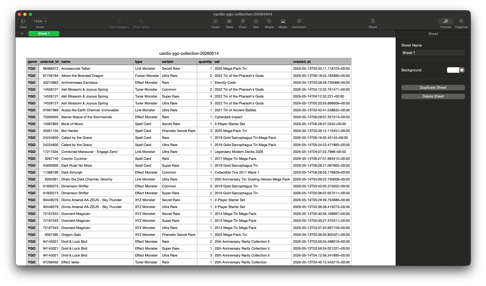

3. The search box plus the **Advanced search** panel below (Type, Keyword, Variant, plus game-specific fields)

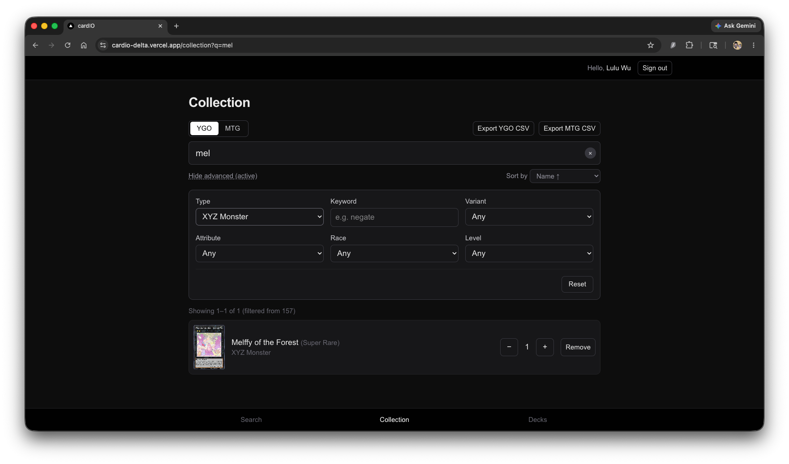

4. **Sort by** dropdown offers 8 sort combinations
5. The card list paginates at 20/page; Prev / Next scroll back to the top

### Building decks

On `/decks`:
1. Use the top form to create a new deck (Name + Game)

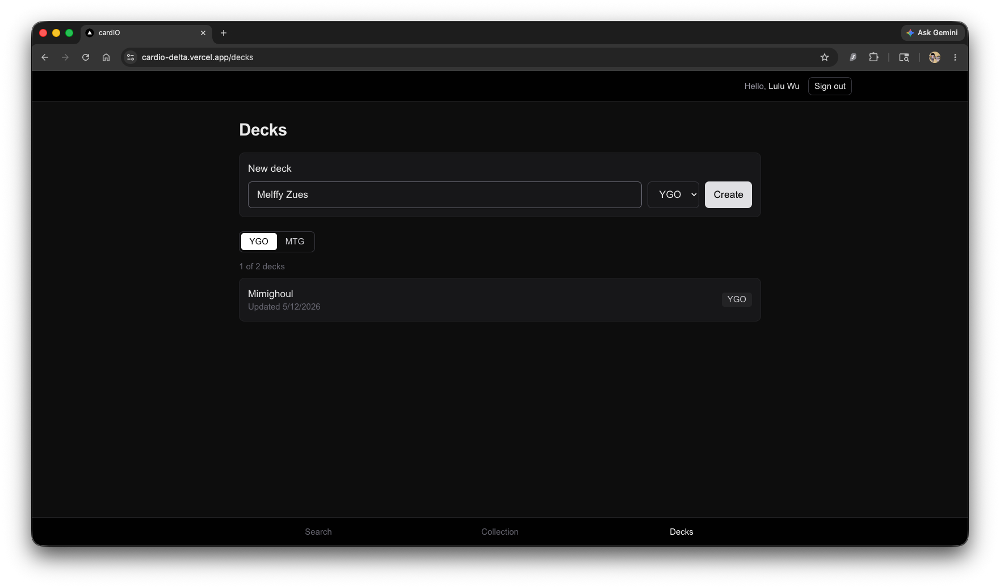

2. Click into a deck to open the editor
3. The left-side search defaults to **From collection**; click into **All cards** when nothing matches

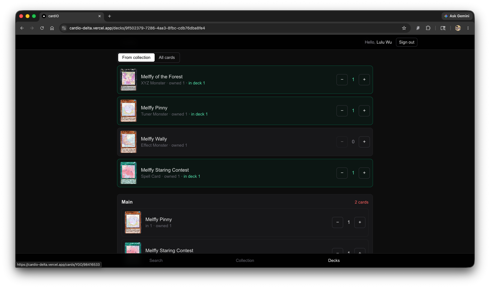

4. `+` / `−` adjusts deck quantity; search results sync with `− N +` in real time
5. The "Missing from collection" panel at the top shows total missing + an estimated TCGPlayer total
6. Click **Export buylist** to download the missing-card CSV (with prices refetched at export time)

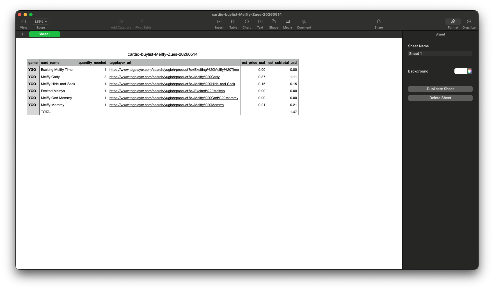

### On mobile

Just open it in Safari / Chrome. The UI is mobile-first by default. PWA install support is on the roadmap.

## Tech Stack

| Layer | Choice | Why |
|---|---|---|
| Framework | **Next.js 16.2.6** (App Router + Turbopack) | RSC + Server Actions + middleware (`proxy.ts`) in one place |
| UI | **React 19** + **Tailwind CSS 4** | No UI library bloat; keep styling weight minimal |
| Language | **TypeScript 5** | Strict mode; treat every lint warning as an error |
| Auth + DB | **Supabase** (`@supabase/ssr` 0.10.x) | Auth + Postgres + RLS in one platform |
| Hosting | **Vercel** | Edge deploys, Cron Jobs, preview environments |
| External APIs | **Scryfall** (MTG) / **YGOPRODeck** (YGO) | Both free, no API key required; Scryfall's symbology CDN handles mana icons |
| Client state | **React useState + URL params** | No Redux/Zustand; state needs live within a single component |

### What this project deliberately doesn't use

- **No React Query / SWR** — Server Components handle server-side fetching. Client `fetch` is only used for `/api/search`, with `AbortController` for cancellation. That's enough.
- **No UI library (shadcn / Radix)** — Tailwind directly, to avoid pulling in the 80% of components I'd never use.
- **No OCR / camera scan** — was on the original roadmap with Tesseract.js. Manual search turned out faster in practice, so **it got cut**.

## Design Decisions (Why, not just What)

> This section captures the *reasoning* behind structural choices.
> Code answers "what"; this section answers "why".

### Splitting `cards` and `user_cards`

**Originally**: a single `collections` table that mixed card data with "who owns it."
**The problem**: in a multi-user system, the same card data gets stored N times (once per owner). Updates fan out, storage bloats, and data goes stale unevenly.
**The decision**:
- `cards`: shared master data, anon-readable, holds `image_url` + the full `raw` jsonb payload
- `user_cards`: each row = "user X owns N copies of card Y in some variant," RLS-protected
- Unique constraint on `(user_id, card_id, variant)` prevents duplicate rows

### One `variant` column, two games

**Originally**: `user_cards` had `condition` (NM/LP/MP/…) and `foil` (boolean).
**The problem**: YGO players don't need `foil`. MTG players don't need `condition`. Each game was carrying a dead column for the other.
**The decision**: a single `variant text` column
- YGO: `"Common"`, `"Secret Rare"`, `"Ultra Rare"`, … (extracted from YGOPRODeck `card_sets[].set_rarity`)
- MTG: `"Nonfoil"`, `"Foil"`, `"Etched"` (from Scryfall `finishes`)
- Different variants = different rows, which naturally models "I have one Foil and two Nonfoils of this card"

### Middleware (`proxy.ts`) does three jobs

1. **Session refresh** — calling `getUser()` on every request lets Supabase rotate the auth token before it expires
2. **Auth gate** — anyone without a session gets bounced to `/login`, except for explicit public paths (`/auth/*`, `/api/*`)
3. **Display-name injection** — after the validated `getUser`, the user's display name is written onto a forwarded request header (`x-cardio-user-name`) so the TopBar reads it from `headers()` **instead of making a second `getUser` call**

The subtle bit: `fwdHeaders.delete(USER_NAME_HEADER)` runs *before* the header is set, so a malicious client can't forge their own display name by sending the header inbound.

### `/api/health` isn't just "ping me"

**Why it exists**: Supabase free-tier projects auto-pause after 7 days of inactivity. For a personal project with light traffic, that's easy to trip.
**How it works**:
- `vercel.json` schedules a daily 12:00 UTC hit on `/api/health`
- The endpoint does a minimal `select id from cards limit 1`
- It **requires `Authorization: Bearer ${CRON_SECRET}`** — otherwise anyone with the URL could hammer it
- The `cards` table has an explicit `GRANT SELECT TO anon` because Postgres checks table-level grants *before* RLS — without that grant, even the read-everything RLS policy gets blocked

### Buylist prices must be refetched live

**The problem**: `cards.raw` is frozen at the first cache write. Prices in that payload could be months — even years — stale. For a "buylist CSV" whose entire point is current prices, that's a silent failure.
**The fix**: when `/decks/[id]` renders, it parallel-refetches Scryfall / YGOPRODeck payloads **only for cards where `inDeck > owned`** (the ones that actually land in the CSV). Fully-owned cards don't trigger a refetch. Next's data cache (`revalidate: 3600`) absorbs repeat opens within an hour.

### `/search` uses draft+commit, `/collection` uses live filter — on purpose

**`/search`**: every commit hits Scryfall / YGOPRODeck (~150ms + politeness delay). Live-filtering on every keystroke would hammer the upstream APIs and feel laggy, so the form has a draft state and an explicit **Apply** button.
**`/collection`**: filtering is client-side substring matching against rows already in memory — **cheaper than the input's own onChange**. An Apply button would add friction for no gain.
**Takeaway**: the surface structure (Advanced toggle + Reset button) looks similar, but the commit model is fundamentally different. The UX divergence is intentional.

### 14 `useState`s → 1 `CollectionState`

**Originally**: `query`, `gameFilter`, `showAdvanced`, `typeFilter`, `keywordFilter`, `variantFilter`, `attributeFilter`, `raceFilter`, `levelFilter`, `colorsFilter`, `sortKey`, `sortDir`, `page`, `prevFilterSig` — fourteen independent `useState` hooks.
**The pain**: `changeGame` needed to reset eight of them in sequence. `filterSig` (used to reset page on filter change) was a pipe-delimited string that could collide (`{kw:"a|b"}` and `{kw:"a", race:"b"}` serialized the same).
**The refactor**:
```ts
const [state, setState] = useState<CollectionState>(() => ({…}));
function patch(p: Partial<CollectionState>) {
  setState((prev) => ({ ...prev, ...p }));
}
```
plus `filterSig = JSON.stringify({…})` to make collisions impossible. Adding a new filter became a one-place change.

### "Adjust state during render" instead of `useEffect(() => setPage(1), [...])`

The `react-hooks/set-state-in-effect` lint rule (correctly) flags synchronous setState calls inside effect bodies. The proper pattern, from React's "Storing information from previous renders" docs:

```ts
const filterSig = JSON.stringify({…});
const [prevSig, setPrevSig] = useState(filterSig);
if (prevSig !== filterSig) {
  setPrevSig(filterSig);
  patch({ page: 1 });
}
```

React immediately re-renders with the new state — no effect overhead, no cascading-renders warning.

### MTG Type dropdown groups by primary type

**The pain**: Scryfall's `type_line` looks like `"Legendary Creature — Human Wizard"`. Deduping those into a dropdown gives a Commander collection 100+ entries.
**The fix**: `mtgPrimaryType(typeLine)` walks a priority-ordered list (`Creature, Land, Instant, Sorcery, Enchantment, Artifact, Planeswalker, Battle, Tribal`) and returns the first match. `"Artifact Creature — Golem"` → `"Creature"`, because that's how players think of it.

### Component split: CollectionList → Toolbar / AdvancedPanel / Item

**Before**: a single 570-line file with ~350 lines of JSX in one component.
**After**: `CollectionList` (411 lines, pure orchestrator) + `CollectionToolbar` (116) + `AdvancedPanel` (202) + `CollectionItem` (82) + `types.ts` (53).
**The trade-off**: total line count went up (864 vs 570), but each file has a focused responsibility. Editing the advanced panel no longer means scrolling through 570 lines of unrelated state management.

### `lib/cards/rawFields.ts` as the single source of truth

`pickSetName`, `pickSetInfo`, `pickYgoRace`, `pickYgoLevel`, `pickMtgColors`, `mtgPrimaryType` — small helpers that pluck specific fields out of the cached `cards.raw` jsonb. Previously scattered across `collection/page.tsx` and `cards/[game]/[externalId]/page.tsx` as near-duplicates with subtly different type guards. Now centralized — when a new consumer arrives, it imports from one place and the behavior matches by construction.

## Local Development

```bash
# 1. Clone
git clone https://github.com/luluwu516/cardio.git
cd cardio

# 2. Install
npm install

# 3. Set up environment variables
cp .env.local.example .env.local
# Fill in your Supabase URL and anon key

# 4. Run schema migrations (in Supabase Dashboard → SQL Editor)
# Apply supabase/schema.sql and supabase/migrations/*.sql

# 5. Develop
npm run dev
# → http://localhost:3000

# 6. Pre-deploy checks
npm run lint
npx tsc --noEmit
npm run build
```

---

## Project Health

After every significant change the project runs a self health check:
- `tsc --noEmit` with zero errors
- `npm run lint` with zero warnings
- `npm run build` passes cleanly
- Scan for cross-file code duplication
- Schema ↔ app-code consistency (columns, policies, indexes)
- Security review (RLS coverage, env-var leakage)

Issues that past health checks have surfaced and fixed:
- Scryfall "Relevance" sort silently overridden by a default `order=name`, making the UI option unreachable
- Deck buylist using months-old prices from `cards.raw` (now refetched live)
- `/api/health` callable without the cron secret
- TopBar and middleware each calling `getUser()` (now passed via header)
- 14 fragmented `useState`s in CollectionList (consolidated)
- MTG `type_line` exploding the Type dropdown into 50+ entries (collapsed to primary types)

---

## Credits

- **Card data**: [Scryfall](https://scryfall.com) (MTG) · [YGOPRODeck](https://ygoprodeck.com) (YGO)
- **Mana symbols**: [Scryfall symbology CDN](https://svgs.scryfall.io)
- **Hosting**: [Vercel](https://vercel.com)
- **Database + Auth**: [Supabase](https://supabase.com)

Built with care by [@luluwu516](https://github.com/luluwu516).
