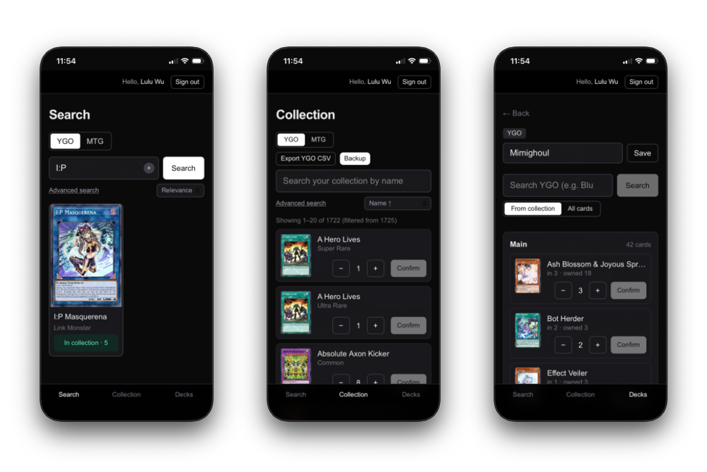
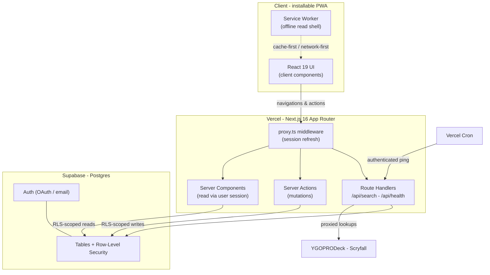

# cardIO

<p align="center">
  
</p>

> Track your Yu-Gi-Oh! and Magic: The Gathering collection down to the rarity, build decks against what you already own, and walk into a card shop with a buylist you can hand to the clerk. Installs as a PWA and reads offline.

<p align="center">
  
  
  
  
  
  
  
</p>



<p align="center">
  <a href="#key-features">Features</a> ·
  <a href="#tech-stack--architecture">Architecture</a> ·
  <a href="#getting-started">Getting Started</a> ·
  <a href="#technical-challenges--solutions">Technical Deep-Dive</a> ·
  <a href="#testing--code-quality">Testing</a>
</p>

---

## What I learned

My Yu-Gi-Oh! collection crossed 3,000 cards at some point, a few Magic: The Gathering — FINAL FANTASY cards mixed in. Playable, but with a familiar friction: even sorted by type, confirming whether I owned one specific card meant fifteen minutes of flipping through binders. More than once I bought a card I "didn't have," got home, and found three already sitting there. Now I owned six. That annoyance became my first Claude Code project.

Designing it with Claude, I met tools I'd never touched: the public card APIs, Vercel for free hosting, Supabase for the database. Once the features and schema were mapped, the packages installed and the TypeScript and SQL scaffolding came together in under an hour. My personal website, hand-built, had eaten a whole summer. Here, describing what I wanted produced a working foundation in minutes, which left me more room to work on how the app should feel to use.

The lesson that stuck came from a feature I deleted. Early on I added OCR camera scanning to read a card from a photo, curious how far the agent could take something I'd never built. It worked, and it impressed me, though getting Tesseract to read Yu-Gi-Oh!'s stylized fonts took patient tuning. Then I used it. Open the app, open the scanner, take the photo, pull the name, search: slower than typing, since the API already did fuzzy text search. So I cut it. A product is the handful of features that earn their place in the workflow, not every impressive thing you can build.

A few other problems showed up the way they do once something is live:

- **Special characters broke search.** Cards like Dark Infant @Ignister, Evil★Twin, and the I:P series never surfaced. Type "IP" instead of "I:P" and nothing came back, because the API's fuzzy endpoint matches literal substrings. On mobile that stings, where a special character means switching keyboards mid-search. Claude's fix matches the query against Yu-Gi-Oh!'s archetype names with both sides reduced to letters and digits, then runs a second archetype search and merges the results. I wouldn't have reached for that alone.
- **Vercel re-optimized images that arrived optimized.** The card APIs serve CDN-sized art, and Vercel resized it again for mobile, work with no payoff. Turning image optimization off in `next.config.ts` settled it.
- **CI/CD stopped being a LinkedIn phrase.** Vercel handled deployment on its own, so I wired up the other half: a check that catches broken code before a user does.

Because the app scratches a real itch, I keep sanding down whatever friction I hit while using it. It centers on Yu-Gi-Oh! today, with Magic support aimed at collection tracking and casual deck drafts. If I get more serious about constructed Magic, that side grows next.

Building with an agent doesn't train the same muscle as writing every line by hand, and I didn't stack raw coding reps the way the slow path would have. What it did was fold months of the experience you'd get from an internship, or years of self-teaching, into one project. I was sketching the next build before this one shipped, curious what I'll trip over, and learn, the time after.

### A note on the name and logo

The project was still only an idea when I went out with a friend who's a vet. He mentioned he'd once wanted to specialize in cardiology, and it clicked: *cardio* starts with *card*. Card Input/Output, cardIO. Input and output is taking data in and sending it back, which is what a card database does all day, and to a collector the cards you keep matter about as much as a heart. The name was perfect.

The logo came next. An anatomical heart felt too busy, and a Valentine heart too corny. A medical paper on his wall had an ECG trace running across it. I went home, opened Figma, and drew the lines. Here is the remarkable logo. It's the part of this AI-built project I'm proudest of.

---

## Why it exists

Scryfall and YGOPRODeck tell you everything about a card. Deck-sharing sites show you what other players built. Neither one knows what sits in your binder.

cardIO tracks your inventory by card and rarity, then builds decks against it. When a deck calls for cards you don't own, you get a priced shopping list ready for the counter.

---

## Key Features

- 🔍 **Unified dual-game search.** One interface over two unrelated upstream APIs: YGOPRODeck for Yu-Gi-Oh!, Scryfall for Magic. Per-game filters cover attribute, race, level and ATK/DEF on one side, color, mana value, power and toughness on the other. An authenticated route handler proxies both.
- 📦 **Variant-aware inventory.** A single `variant` column spans YGO rarities and MTG finishes (Nonfoil, Foil, Etched). One printing in two rarities occupies two rows that still sum into one owned count.
- 🃏 **Collection-first deck builder.** Search your own cards before the wider catalog. YGO Fusion, Synchro, Xyz and Link monsters route themselves to the Extra Deck. The builder checks TCG banlist legality and computes `in-deck − owned` with TCGPlayer price estimates.
- 🛒 **Wishlist Store Mode.** A read-only view built for the shop counter: large art, tap to go fullscreen, oversized quantities, a check-off list that leaves the wishlist intact, and a running spend total. A Screen Wake Lock keeps the screen up while you shop, and your private price notes stay hidden here.
- 📴 **Offline collection.** A hand-written service worker serves your collection with no network. Filtering, sorting and paging keep working, because they run in the browser over the rows the page already shipped.
- 💾 **Zero-API backup and restore.** Export the whole collection, raw API payloads included, into one self-contained CSV. Restoring it touches no external API. An RFC-4180 parser handles the JSON sitting inside those cells.
- 🔐 **Invite-only auth.** Supabase Auth (Google OAuth, email and password) with Row-Level Security isolating each user inside the database.
- 🧹 **Data-quality layer.** A normalizer repairs the junk rarities YGOPRODeck returns. A local alias table surfaces cards under their official English name while the upstream source lags behind.

---

## Tech Stack & Architecture

| Layer | Technology |
| --- | --- |
| **Framework** | Next.js 16 (App Router · React Server Components · Server Actions) |
| **Language** | TypeScript 5 (strict), React 19 |
| **Styling** | Tailwind CSS 4 |
| **Backend** | Supabase: Postgres, Auth, Row-Level Security, cookie sessions via `@supabase/ssr` |
| **Data sources** | YGOPRODeck API (YGO) · Scryfall API (MTG) |
| **PWA / Offline** | Web App Manifest + custom service worker (network-first RSC caching) |
| **Testing** | Vitest 4 |
| **Quality gate** | ESLint 9 · `tsc --noEmit` · GitHub Actions CI |
| **Infra** | Vercel (hosting + Cron) · Supabase (managed Postgres) |

### System design

Pages render as React Server Components that query Postgres through the signed-in user's session, so Postgres enforces authorization through RLS rather than the client. Mutations go through Server Actions. The only endpoints a browser calls are Route Handlers proxying the card APIs, and auth gates those, so the open internet cannot burn through a third-party rate limit.


```mermaid
flowchart TD
    subgraph Client["Client - installable PWA"]
        UI["React 19 UI<br/>(client components)"]
        SW["Service Worker<br/>(offline read shell)"]
    end

    subgraph Edge["Vercel - Next.js 16 App Router"]
        MW["proxy.ts middleware<br/>(session refresh)"]
        RSC["Server Components<br/>(read via user session)"]
        SA["Server Actions<br/>(mutations)"]
        RH["Route Handlers<br/>/api/search - /api/health"]
    end

    subgraph Data["Supabase - Postgres"]
        DB["Tables + Row-Level Security"]
        AUTH["Auth (OAuth / email)"]
    end

    EXT["YGOPRODeck - Scryfall"]
    CRON["Vercel Cron"]

    UI -->|navigations & actions| MW
    SW -.->|cache-first / network-first| UI
    MW --> RSC & SA & RH
    RSC -->|RLS-scoped reads| DB
    SA -->|RLS-scoped writes| DB
    RH -->|proxied lookups| EXT
    RH --> DB
    AUTH --- DB
    CRON -->|authenticated ping| RH
```

**Module interplay**

- **`proxy.ts`**, Next 16's middleware convention, refreshes the Supabase session cookie on each request, so Server Components downstream skip a second auth round-trip.
- **Server Components** query Postgres straight. RLS policies (`auth.uid() = user_id`, plus a deck-ownership join) confine a user to their own rows.
- **Route Handlers** hold the only outbound calls to external APIs, behind auth, with fetch timeouts and response caching.
- **Vercel Cron** pings an authenticated `/api/health` once a day so the free-tier Postgres stays awake.

---

## Getting Started

### Prerequisites

| Requirement | Version |
| --- | --- |
| Node.js | ≥ 22 |
| npm | ≥ 10 |
| Supabase project | any (free tier works) |

### 1. Clone & install

```bash
git clone https://github.com/luluwu516/cardio.git
cd cardio
npm install
```

### 2. Configure environment

Create `.env.local` in the project root:

```bash
# Supabase: Project Settings > API (safe to expose, RLS enforces access)
NEXT_PUBLIC_SUPABASE_URL=https://<your-project>.supabase.co
NEXT_PUBLIC_SUPABASE_ANON_KEY=<your-anon-key>

# Server-only secret shared with Vercel Cron for the keep-alive ping
CRON_SECRET=<any-long-random-string>
```

> This project ships no `service_role` key. Every query runs under the signed-in
> user's RLS-scoped session, so a leaked anon key grants nothing that user lacks.

### 3. Provision the database

Run [`supabase/schema.sql`](supabase/schema.sql) in the Supabase **SQL Editor**. It holds the whole schema (tables, indexes, grants, RLS policies and the `updated_at` trigger), stays idempotent, and survives a re-run.

### 4. Lock it down (invite-only)

Under **Authentication → Providers**, disable open sign-ups, then add users through **Authentication → Users**.

### 5. Run

```bash
npm run dev     # http://localhost:3000
```

---

## Technical Challenges & Solutions

### 1. An offline read shell on the App Router

**The problem.** I wanted the collection browsable with no signal, since card shops eat phone reception. A cache-every-page service worker breaks on the App Router: client navigations skip HTML and fetch React Server Component payloads from the same URL, carrying a per-build `?_rsc=<hash>` query string. Key the cache on the full URL and every offline navigation misses.

**Diagnosis.** Watching the network panel during one client navigation showed two request shapes for a single route: a document request with `mode: "navigate"`, and an RSC request carrying an `RSC: 1` header plus a `_rsc` hash that rotates on each deploy. Cache hits landed on the exact document URL and nowhere else, so RSC requests missed the moment the network dropped.

**Solution.** I wrote the worker by hand instead of pulling in Workbox or Serwist, which both want a webpack config this Turbopack build doesn't have. It branches on request shape:

- Hashed build assets under `/_next/static/` are immutable, so they go cache-first.
- Document and RSC requests (`mode === "navigate"`, or an `RSC` header or `_rsc` param) go network-first, falling back to a cache match with `ignoreSearch: true`, which lets a cached page answer despite the rotating hash.
- `/api/*`, `/auth/*` and every non-GET request pass through untouched, so writes and live search fail offline instead of returning stale data.

**Result.** The collection page already ships every owned row and filters, sorts and pages in the browser, so caching that one response covers the entire offline experience, search included. The worker registers in production alone, since dev Turbopack rotates asset hashes that a cache would keep serving stale. Logging out clears the cache, which holds authenticated HTML.

### 2. Data integrity and concurrency on a shared table

**The problem.** Every user reads the same `cards` rows. A pre-release pass over the RLS policies turned up an `UPDATE` policy open to any authenticated user, so one account, or one stolen session, could rewrite a card name or image for everybody. Two smaller risks sat behind it: two clients caching the same new card could race, and a CSV restore could overwrite shared rows with one user's backup payload.

**Diagnosis.** I traced each write to the table with `grep` for `.from("cards")` and sorted them into inserts and updates. Nothing depended on updating an existing card. Each path looked the row up first and wrote only when it was missing, which left the `ON CONFLICT DO UPDATE` branch reachable through a millisecond race that rewrote near-identical data.

**Solution.** I now treat `cards` as write-once from the client side.

1. RLS grants read and insert. Dropping the `UPDATE` policy and grant closed the vandalism path. A refresh-from-source flow, should I build one, runs server-side with elevated privileges.
2. Card caching became insert-if-missing (`ON CONFLICT DO NOTHING`) followed by a `SELECT` on `(game, external_id)` to resolve the id, which holds up when two clients insert the same card at once.
3. The restore path passes `ignoreDuplicates`, so one user's backup cannot overwrite another user's view of a card while still filling in rows the database lacks. The zero-API restore survives.

**Result.** Concurrent writes and untrusted backup payloads both behave, verified against the policies themselves.

### 3. Card names you can't type

**The problem.** Yu-Gi-Oh! prints characters into card names that no keyboard offers up: the star in `Evil★Twin`, the at-sign in `Dark Infant @Ignister`, the colon in `I:P Masquerena`. YGOPRODeck's fuzzy-name endpoint (`fname`) matches on literal substrings, so a player who types "Evil Twin" or "Ignister" gets an empty result for the cards they mean.

**Diagnosis.** Searching "Evil Twin" against `fname` returned nothing, while those cards sat in the database under the archetype "Evil★Twin". The misses shared one cause: punctuation the official name carries and the typed query drops.

**Solution.** Alongside the `fname` request, and on the same round-trip, I check whether the query maps onto a Yu-Gi-Oh! archetype. Normalizing both sides down to `[a-z0-9]` collapses `Evil★Twin` and "Evil Twin" onto one key, `eviltwin`. A hit fires a second `cardinfo.php` call with `archetype=<match>`, and I merge the two result sets, dedupe by passcode, and list the `fname` matches first. The archetype list comes from a single `/archetypes.php` call cached for a day. Two guards hold it in check: a four-character floor keeps "dark" from dragging in the whole Dark Magician archetype, and after an exact match I accept an archetype that prefixes the query, so "Evil Twin Lil-la" still resolves.

**Result.** The archetype lookup runs in parallel with the main search, so it adds no latency when it fires and none when it doesn't. Players reach `@Ignister`, `Evil★Twin` and `I:P` cards with plain letters.

### Additional engineering notes

- PostgREST caps a read at 1000 rows and drops the remainder without complaint. The collection and backup loaders walk the table in 1000-row windows ordered by `id`, so a large collection loses nothing.
- Opening a wishlist used to fan out into dozens of parallel price lookups, since almost every card on one counts as unowned. Wishlists read cached payloads now and stay under YGOPRODeck's rate limit.
- Returning from a card detail page restores the exact result set, because the filter and sort state mirrors into the URL through `replaceState` rather than a debounced router push.
- Every outbound fetch carries an 8-second `AbortSignal.timeout`, so one hung upstream cannot stall a render.

---

## Testing & Code Quality

**Strategy.** Vitest covers the pure logic where a regression corrupts data without raising an error:

- CSV round-trip, `parseCsv` against `csvEscape`, across commas, escaped quotes, newlines and embedded JSON. This one guards backup and restore.
- The YGO rarity normalizer: junk denylist, casing and spacing, unknown values kept, dedupe, hierarchy order.
- The alias resolver: official-name mapping and game scoping.

```bash
npm test          # Vitest, 23 unit tests
npm run lint      # ESLint 9
npx tsc --noEmit  # strict type-check
npm run build     # production build
```

**CI.** A [GitHub Actions workflow](.github/workflows/ci.yml) runs type-check, lint, test and build on every push and pull request to `main`, gating the branch before Vercel ships. I kept the scope at pure-function unit tests and skipped E2E, which a project this size would spend more time maintaining than debugging.

**Conventions.** Strict TypeScript. An RLS-first security model with no `service_role` key. One `schema.sql` as the source of truth, carrying a dated change log. Keyboard focus rings, contrast-checked text and iOS safe-area handling throughout the UI.

---

## Project Structure

```
app/
├── api/            # Route Handlers: authed search proxy + cron health check
├── cards/          # Card detail + variant picker
├── collection/     # Inventory: list, toolbar, CSV backup/restore
├── decks/          # Deck builder, buylist, wishlist "Store Mode"
├── search/         # Dual-game search with advanced filters
└── login/          # Auth (OAuth + email)
components/          # Shared UI (nav, offline banner, service-worker registrar)
lib/
├── cards/          # API clients, variant/rarity logic, aliases, upsert helpers
├── supabase/       # SSR client + session middleware
└── csv.ts          # RFC-4180 parser + export helpers
public/sw.js        # Offline-shell service worker
supabase/schema.sql # Single source of truth: tables, RLS, grants, triggers
```
